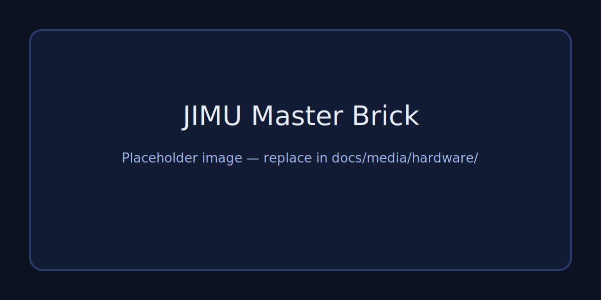
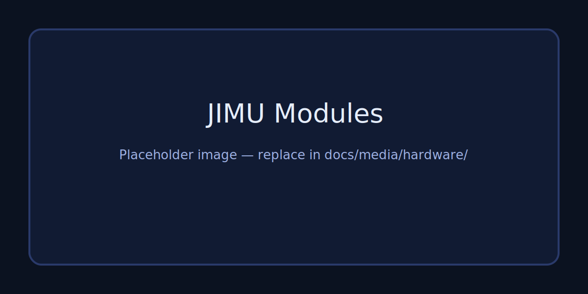
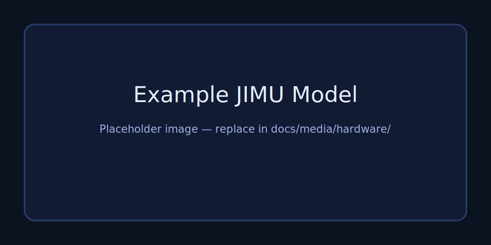
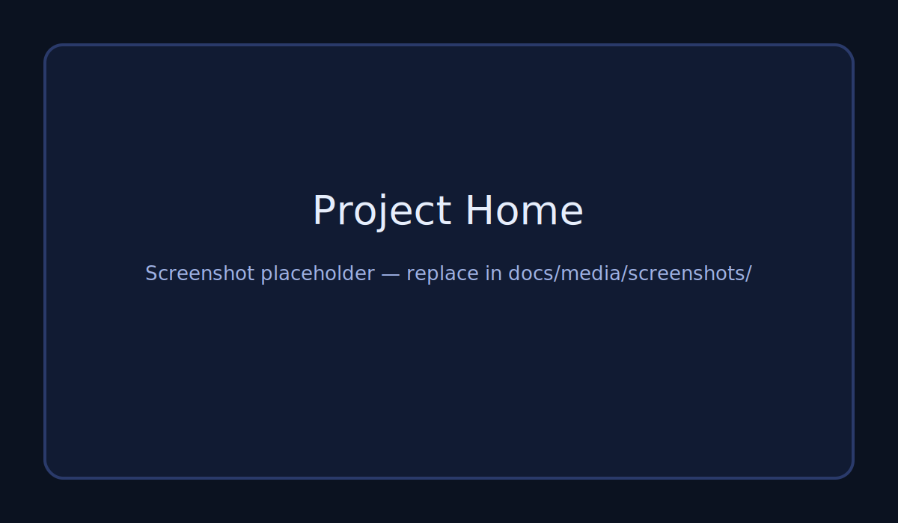
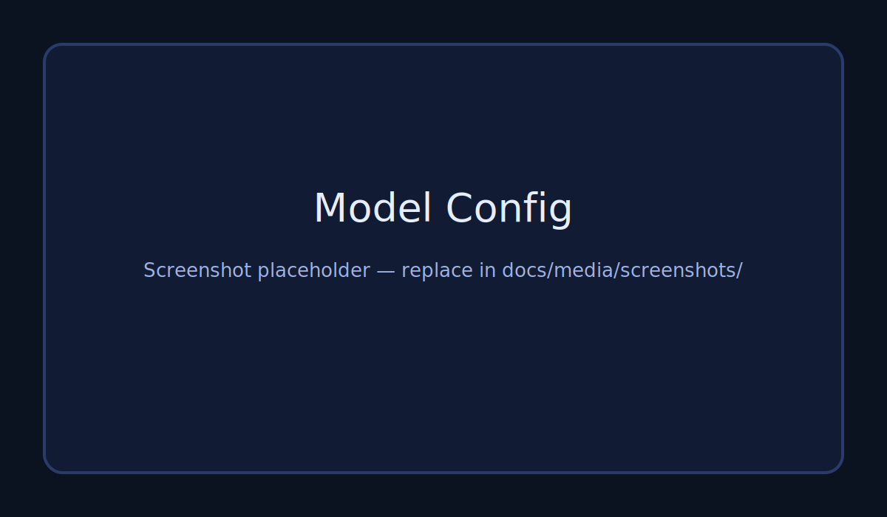
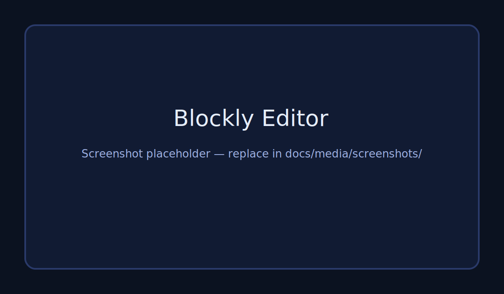
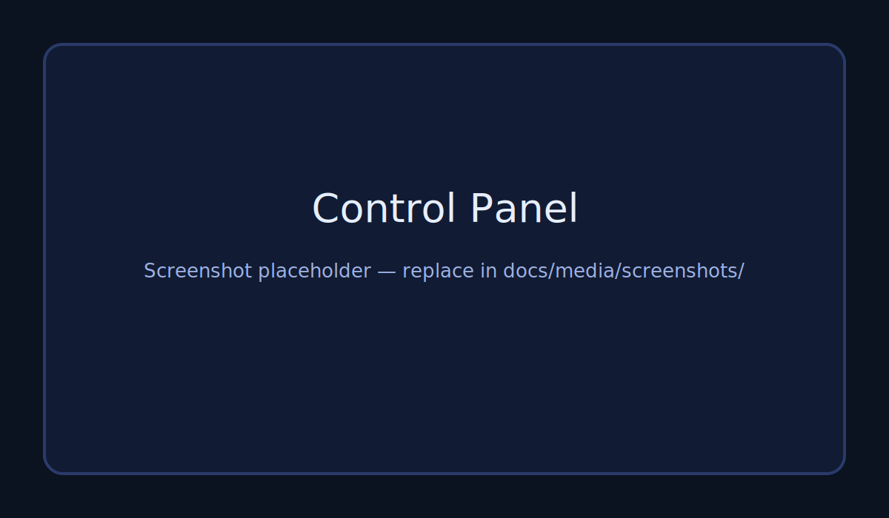

# JIMU Control

Block-based programming and live control app for **UBTECH JIMU** robots (Windows-first). Build Blockly programs, connect over Bluetooth to a Master Brick, and drive servos/motors + read sensors in real time.

> Not affiliated with UBTECH. This project documents and implements a reverse‑engineered JIMU BLE protocol.

## What you get
- **Desktop app** (Electron + React + Vite) designed for education + quick prototyping.
- **Device SDK** in `jimu/` that handles scan/connect/boot/status + common module commands.
- **Protocol documentation** in `docs/protocol.md` (public, working draft).
- **Probe scripts** in `probe/` for reverse-engineering and validating commands.

## Hardware (photos)
Placeholders for now — drop your own photos into `docs/media/` (see `docs/media/README.md`).

## App screenshots
Placeholders for now — put real screenshots into `docs/media/screenshots/`.

## Project status
- **Today (works in repo):** Electron shell, BLE scan/connect, boot/status parsing, battery, basic servo/motor/sensor commands (via `jimu/`).
- **Next (app direction):** real project home, model configuration UX, Blockly workspace with JIMU blocks, runtime scheduler (parallel actions + triggers), project save/load.
- **Known gaps:** installer/packaging, full block set, simulator backend, stronger runtime sandboxing.

More detail: `docs/project/status.md`

## Download & run (Windows)
Prereqs: Windows 10/11, Bluetooth adapter, Node.js LTS.

1) Clone  
`git clone https://github.com/<your-org>/JIMU-control.git`  
`cd JIMU-control`

2) Install deps  
`npm install`

3) Run dev (Vite + Electron)  
`npm run dev`

4) Build + run production shell  
`npm run build`  
`npm start`

Troubleshooting and BLE notes: `docs/getting-started/windows.md`

## Documentation
- Start here: `docs/index.md`
- Architecture (overview + links): `docs/architecture.md`
- JIMU Bluetooth protocol (reverse‑engineered): `docs/protocol.md`
- Scan captures/raw notes: `docs/scan_result.md`

## Contributing
- Workflow + doc conventions: `docs/contributing.md`

## License
See `LICENSE`.
